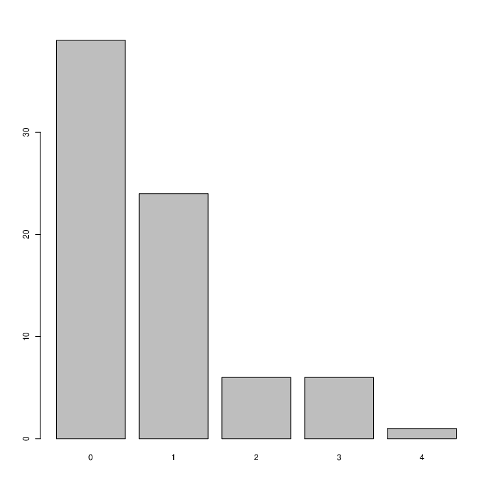

# At komme i gang

Vi har importeret datasættet. Med `download.file`, `load` og printet starten af
data med `head(data)`. 
Vi har et sæt med `HM M HHM M M M`, formatteret som: `"H","M","M","H","H","M","M","M","M"`.
Hvor H er et hit og M er et miss. Ud fra det kan man udregne en stribelængde
(streak length). Ud fra det viste sæt har vi en streaklængde på: 1, 0, 2, 0, 0,
0.

Vi skal lave en funktion til at `calc_streak` til at udregne streak fra data
sættet.

**Opgave 1**  
I en streaklængde på én er det et mål og en misser. Med en streaklængde på nul
er der én misser.

**Opgave 2**  
Den typiske streaklængde er på 0. Den længste streaklængde er på 4.

**Opgave 3**  
Med en fair mønt får vi: 
`H:59, M:41`   
Med en unfair mønt får vi:
` H:26, M:74`

**Opgave 1**

Vi skal lave en simulering af en scoringsprocent på $0.45\%$. Dette må betyde at
der er en chance for at $H: 0.45$ og $M: 0.55$.

Kobe's streak:  

Streak of the simulation:  

Det typiske antal mål for den uafhængige spller er også 0. Det gennemsnitlige
antal mål for denne uafhængige spiller er: $133*0.45 = 59.85$ mål.*

**Opgave 2**  
Hvis vi kørte simuleringen en anden gang, ville vi forvente at få noget der
minder om den samme fordeling som den første, dog ikke nøjagtig det samme.

**Opgave 3**  
Forudsætningen for om Kobe har en varm hånd er at:  
$P(\text{skud}\ 1 = 1) = 0.45$  
$P(\text{skud}\ 2=1 |\text{skud}\ 1= 1) = 0.60$  
, dermed at vi har større chance for at score det næste mål, når vi har scoret
det første. 

Hvis teorien om den varme hånd ikke holder vil:  
$P(\text{skud}\ 1 = 1) = 0.45$  
$P(\text{skud}\ 2=1 |\text{skud}\ 1= 1) = 0.45$.  
Dette betyder at når Kobe har scoret et mål, hvis chancen for at han scorer det
næste være lige så stort som chancen for det første. Hvis dette er tilfældet, er
hændelserne uafhængige. Vi har de to fordelinger, Kobe og den simulerede. Den
simulerede kan udfaldet blive `"H"` eller `"M"`. Når der simuleres er disse
uafhængige hændelser med en bestemt sandsynlighed for et givent udfald. 

Hvis Kobe har en varm hånd, er det som tidligere omtalt ikke en uafhængig
hændelse. 

Hvis fordelingen for Kobes' streak ligner den simulerede, da er Kobes' streak
en uafhængig hændelse.

Hvis vi kigger på de to fordelinger, da ses det at de ligner hinanden. De er
begge højreskæve og har begge én top (mode).
Hvis Kobe havde en varm hånd, da ville formentlig ikke se et så stort drop off
mellem 1 og 2 mål i stræk.
