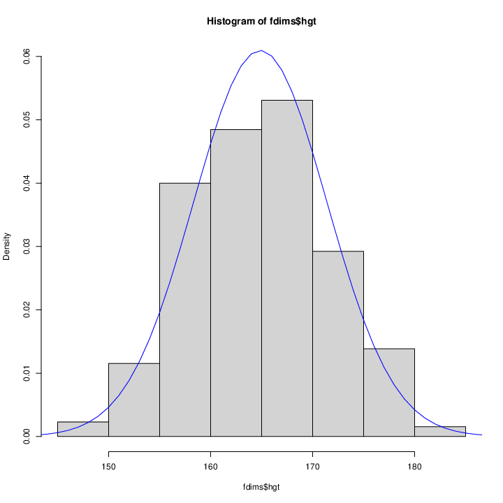
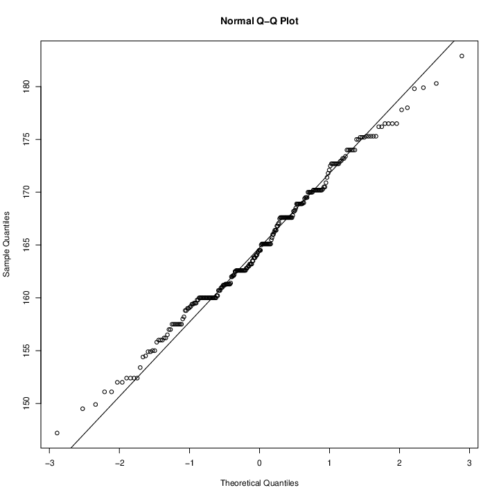
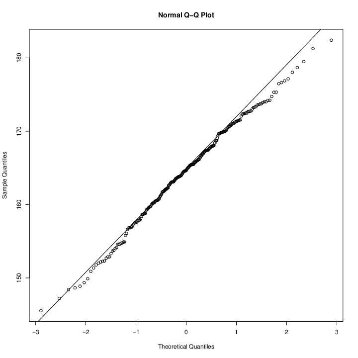
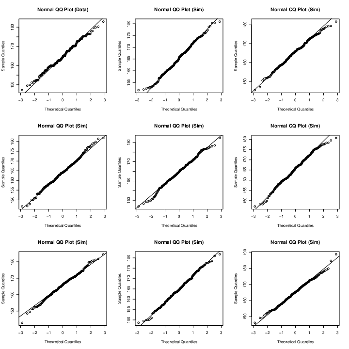
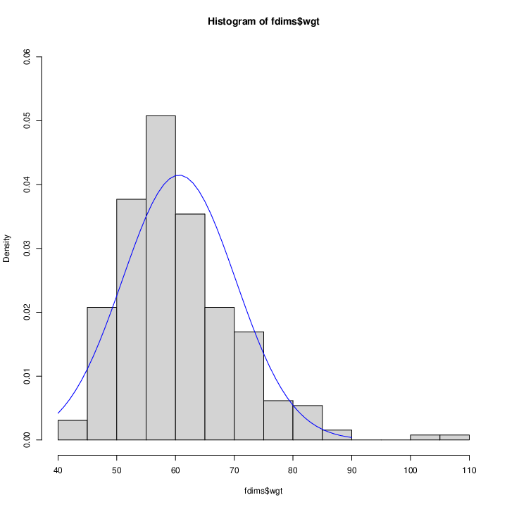
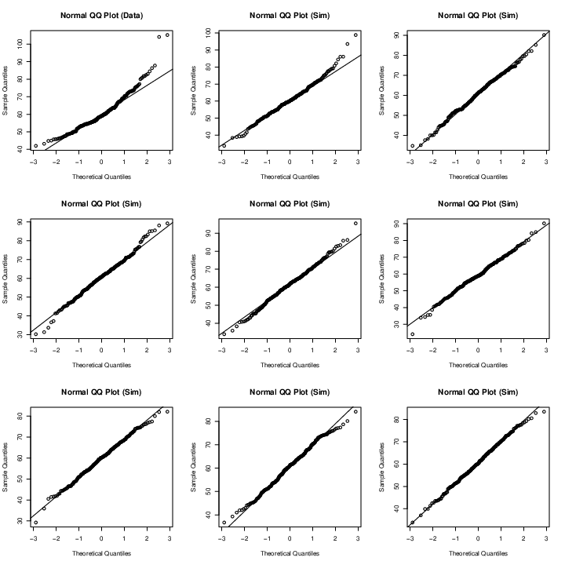
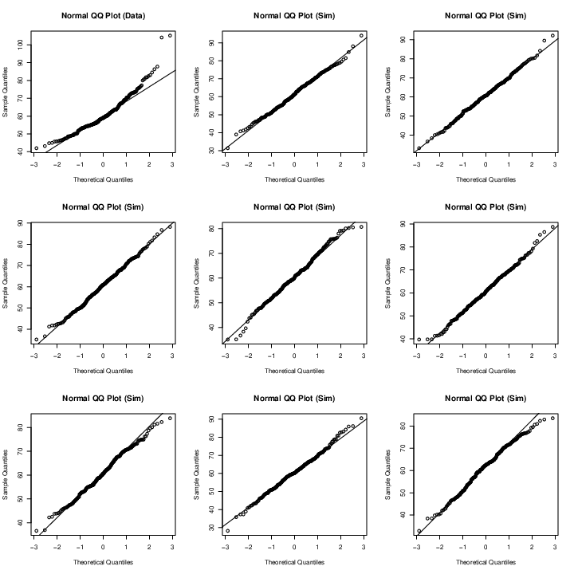

# Øvelse 4

Vi har to histogrammer, et over kvinders, og et over mænds højde.
**for kvinder:**  
  
**for mænd:**
  
Begge histogrammer har en klokkeform. De er hverken venstre- eller højreskæv.
Dette tyder på at dataen vi har er normalfordelt.

Vi lægger en kurve hen over fordelingen:  
  
Her ligner det at data følger en normal fordeling.

Vi vil gerne finde ud af om data egentlig er normalfordelt, dette vil vi gerne
kunne kvantificere. Hvis punkter tæt følger linjen, vil det være normalfordelt.  
  
Som beskrevet, er halerne ikke så tætte på linjen. Så vi må stille spørgsmålet
om hvornår er punkterne tæt nok på denne linje til at vi kan kalde data
normalfordelt.

Vi kan generere en vektor af normalfordelte værdier baseret på lænden af det
datasæt vi vil sammenligne med, samt standardafvigelse og spredning. Med denne
data laver vi et sandsynlighedsdiagram som det lige ovenfor.  
  
Vi kan også simulere flere:   
  
Her vi se at disse ligner hinanden, næsten til forveksling. Den ene hale på den
simulerede er dog lidt tættere, end den observede. Ud fra dette kan vi lave en
klar vurdering af at højden for kvinder er normalfordelt.

**Normal fordeling af kvinders vægt**

Først viser vi et tæthedshistrogram med tilhørende tæthedsfunktion.
For at oprette y værdierne bruger vi dnorm til at beregne tætheden af hver af
disse x-værdier i en fordeling, der er normalfordelt med middelværdien fra 
og standardafvigelse fhgtsd.  
  
Når man kigger på histogrammet, ses at data har en klokkeform. Der er dog nogle
outliers.  
  
Når man kigger på sandsynlighedsdiagramet, ses det at data ikke følger linjen,
særligt omkring halerne. 
Vi simulerer flere   
  
Ud fra dette kan vi konkludere at kvinders vægt er normalfordelt, men er
højreskæv.

**Normalfordelte sandsynligheder**  
Vi beregner en Z-score, her anvendes den standardiserede normalfordeling (hvor
arealet under grafen er $=1$).
```R
@> 1 - (pnorm(q = 182, mean = fhgtmean, sd = fhgtsd))
[1] 0.004434387
```
Så den teoretiske sandsynlighed for at en kvinde er over 182 er $0.04434$
Vi kan også finde sandsynligheden ud fra de observerede værdier.
```R
sum(fdims$hgt > 182 / length(fdims$hgt))
[1] 0.003846154
```
Disse værdier ligger tæt på hinanden

**Opgaver for resten af datasættet**
  - bii.di er plot B
  - elb.di er plot C
  - age er plot D
  - che.de er plot A

Alder er kategorisk data, grupperet i trin af ét år.
