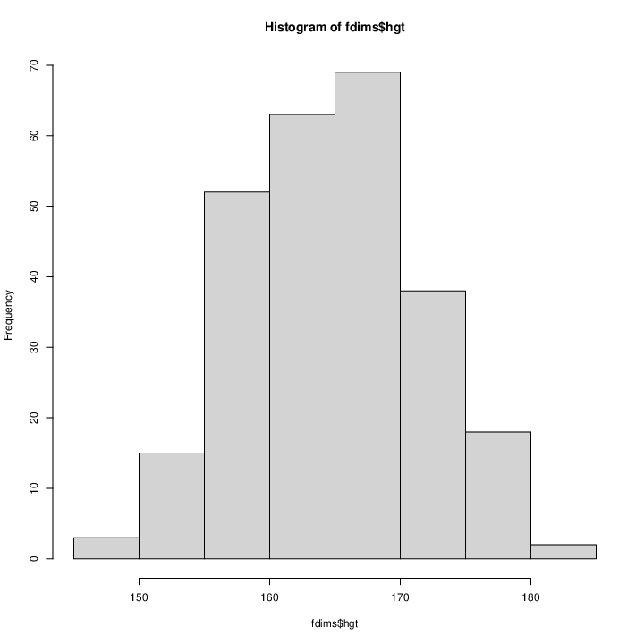
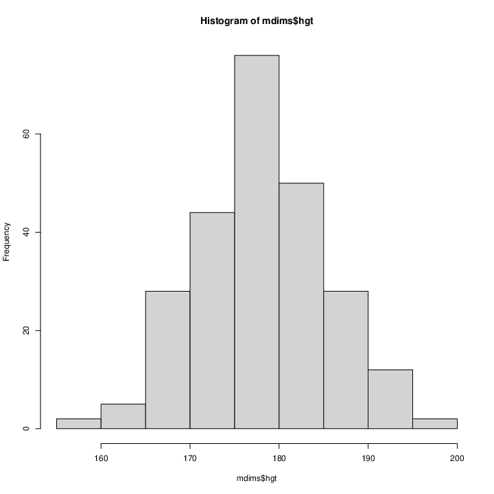

# Øvelse 4

Vi har to histogrammer, et over kvinders, og et over mænds højde.
**for kvinder:**  
  
**for mænd:**
  
Begge histogrammer har en klokkeform. De er hverken venstre- eller højreskæv.
Dette tyder på at dataen vi har er normalfordelt.
